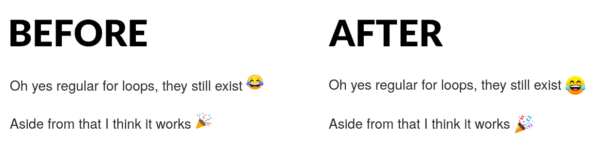

# GitHub System Emoji

This is a Firefox extension that makes GitHub use the system emoji font on
Linux, FreeBSD, and other non-Windows, non-macOS systems.

When browsing GitHub on non-Apple and Microsoft platforms GitHub performs image
replacement on emoji, replacing the text with mis-aligned images of the super
ugly Noto Color Emoji font. This extension alters the user agent to appear as
Windows when on GitHub so that it does not mess with the emoji and uses the
emoji font installed on your system.

## Screenshot

This screenshot shows the output before the extension is enabled and after
(where it uses my system emoji font, [JoyPixels](https://www.joypixels.com/)).

## Install

[Download from Firefox Add-Ons](https://addons.mozilla.org/en-US/firefox/todo/)
